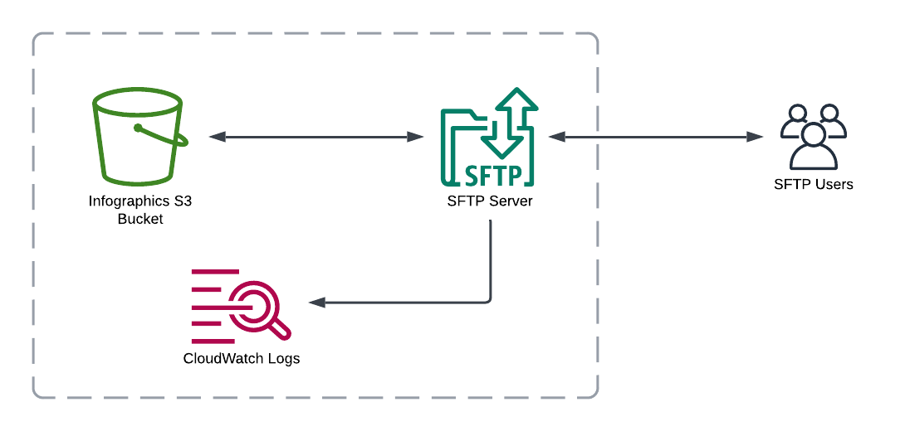

# Journalist Infographics Cloud Stack


This repository's purpose is to provide the cloud stack and provision a storage solution for infographics created by The Economist journalists.



See: [AWS Cloud Development Kit (CDK)](https://github.com/aws/aws-cdk)

## Quick Start

To get started you must set up a `.env` file. You can copy the [template](.env.example) and set out the minimum request to get started:

To build, create a `.env` file with the default configuration needed (you can copy the [template](.env.example) file to help you get started).

- `APP_NAME` - This is the name of your app and is used cloudformation template prefixes
- `S3_CONTENT_PATH` - local path to your static site files. This is _not required_ if running from docker, as the mount point will be used. View the [docker instructions](#Docker) for more information.

Ensure you have your [AWS CLI](https://docs.aws.amazon.com/cli/latest/userguide/cli-configure-profiles.html) variables set up so that CDK can access your AWS account, then run:

`npm run cdk:deploy`

Alternatively, to destroy, run

`npm run cdk:destroy`

## Advanced Usage

By default, the `.env` file is used on the root of the project. However, you can create multiple .env files, such as one with `.env.example.com`. On deployment run `ENV_FILE=.env.example.com npm run cdk:deploy` to use this configuration file.

### Extended Deployment Configuration

#### Metadata

- `TAGS` - define tags for every resources, with keys and values separated by `=` and tags separated by `,`, for example, `Author=Bob Dylan,Project=test`.

#### S3

- `S3_BUCKET_NAME` - a unique name for a S3 bucket to be provisioned
- `S3_FORCE_REMOVE` _(default: 0)_ - a numerical value (0 for false, 1 for true) to indicate whether the S3 bucket should be force emptied and deleted when stacks are destroyed or objects are reuploaded. You will loose your data in this bucket if set to `1`.
- `S3_CACHE_CONTROL` _(default: \*:public, max-age=0)_ -This is a list of glob patterns and cache control headers for S3 objects. By default, nothing is cached - but you'll probably want to set up caching by defining a rule (such as `*.js`) and a cache-control header value (such as `public, max-age=31536000, immutable`). Separate multiple values with a pipe (`|`).
  An example of a bunch of cache control headers for a gatsby site:

  ```
  S3_CACHE_CONTROL=*.html:public, max-age=0, must-revalidate|page-data/*:public, max-age=0, must-revalidate| chunk-map.json:public, max-age=0, must-revalidate|webpack.stats.json:public, max-age=0, must-revalidate|static/*:public, max-age=31536000, immutable|*.js:public, max-age=31536000, immutable|*.css:public, max-age=31536000, immutable|favicon.ico:public, max-age=2628000
  ```

  ### Transfer Family

  Currently there are no special configuration options available for the Transfer Family SFTP server.

## Docker

You can run this directly from docker to install your static site.

```bash
docker build ./ -t infographics-test
docker run --rm \
  --env-file=.env \ # the location of your env file
  --env AWS_SECRET_ACCESS_KEY=$AWS_SECRET_ACCESS_KEY \ # aws keys - can be included in env file
  --env AWS_ACCESS_KEY_ID=$AWS_ACCESS_KEY_ID \
  --env AWS_DEFAULT_REGION=eu-west-1 \
  --volume /path/to/your/content:/srv \ # path of your content, to the /srv mount point
  infographics-test
```

This docker container runs the deployment based on the supplied env file. The static content variable, however, is ignored (S3_CONTENT_PATH) and always set to /srv - which is mounted to the container.

## Preview

See the sister project, [gatsby-typescript-scratch-boilerplate](https://github.com/drinkataco/gatsby-typescript-scratch-boilerplate) to see a preview of this repository deployed!
